# Mobo Ticketing Service

Mobo is a modern, high-performance backend API for a movie theater ticketing and reservation system. It provides a robust set of features for managing users, movies, showtimes, venues, and aggregated analytics. The system supports secure authentication (including OAuth), role-based access control (Admin vs. Customer), and transactionally safe bookings.

## Architecture

Mobo follows a strict **Domain-Driven Design (DDD)** architecture. The codebase is organized by business capabilities (domains) rather than technical concerns (layers). This ensures that business logic is completely isolated from infrastructure, making the application highly maintainable, testable, and resilient to change.

### Dependency Flow

The core principle is that **Domain packages are pure**. They do not import anything from the HTTP transport layer or the database layer. Instead, technology adapters (like the HTTP server and Postgres repositories) depend downward on the domain packages to implement their interfaces.

```mermaid
graph TD
    CMD[cmd/server/main.go] --> HTTP[internal/api]
    CMD --> PG[internal/postgres]
    CMD --> AUTH_INFRA[internal/auth]

    HTTP --> USER_DOM[internal/user]
    HTTP --> MOVIE_DOM[internal/movie]
    HTTP --> SHOW_DOM[internal/showtime]
    HTTP --> VENUE_DOM[internal/venue]
    HTTP --> DASH_DOM[internal/analytics]
    HTTP --> AUTH_INFRA

    PG --> USER_DOM
    PG --> MOVIE_DOM
    PG --> SHOW_DOM
    PG --> VENUE_DOM
    PG --> DASH_DOM
    PG --> DB[internal/dbgen]

    USER_DOM -.- |"NO dependency on"| HTTP
    USER_DOM -.- |"NO dependency on"| PG
    MOVIE_DOM -.- |"NO dependency on"| HTTP
    MOVIE_DOM -.- |"NO dependency on"| PG

    style USER_DOM fill:#2d5a27,stroke:#4caf50
    style MOVIE_DOM fill:#2d5a27,stroke:#4caf50
    style SHOW_DOM fill:#2d5a27,stroke:#4caf50
    style VENUE_DOM fill:#2d5a27,stroke:#4caf50
    style DASH_DOM fill:#2d5a27,stroke:#4caf50
    style HTTP fill:#1a3a5c,stroke:#2196f3
    style PG fill:#1a3a5c,stroke:#2196f3
    style DB fill:#5a3a1a,stroke:#ff9800
```



### Project Structure

```text
ticketing-service/
├── cmd/server/                 # Application entry point. Initializes dependencies and starts the server.
├── config/                     # Configuration management (Viper) reading from .env.
├── internal/
│   ├── auth/                   # Core authentication logic (JWT generation/verification, OAuth setup, password hashing).
│   ├── api/                    # HTTP Transport layer (Adapters). Contains Chi router, Handlers, and Middleware.
│   ├── postgres/               # Database adapter layer. Implements domain repository interfaces and manages pgx connection pooling.
│   ├── dbgen/                  # Auto-generated SQL code via sqlc. Only imported by the postgres adapter.
│   │
│   │ # DOMAIN PACKAGES (Pure Business Logic)
│   ├── analytics/              # Aggregated dashboard metrics and revenue data.
│   ├── movie/                  # Movie catalog management.
│   ├── showtime/               # Scheduling and availability tracking for movies.
│   ├── user/                   # User identity, roles, and authentication workflows.
│   └── venue/                  # Physical theater location management.
│
├── pkg/                        # Reusable, domain-agnostic utilities (e.g., zap logger).
└── sql/                        # Raw SQL schema migrations and sqlc query definitions.
```

## Tech Stack & Tools

- **Language:** Go (Golang)
- **Database:** PostgreSQL
- **Database Driver / Pool:** [pgx/v5](https://github.com/jackc/pgx)
- **Data Access:** [sqlc](https://sqlc.dev/) (Type-safe SQL compiler)
- **HTTP Router:** [go-chi/chi](https://github.com/go-chi/chi)
- **Validation:** [go-playground/validator](https://github.com/go-playground/validator)
- **Authentication:** JWT (JSON Web Tokens) with rotating HttpOnly cookies
- **OAuth:** [markbates/goth](https://github.com/markbates/goth) (Google Auth integration)
- **Logging:** [uber-go/zap](https://github.com/uber-go/zap) (Structured JSON logging)
- **Configuration:** [spf13/viper](https://github.com/spf13/viper)

## Key Features

- **Decoupled Architecture:** Business logic operates independently of how data is stored or served.
- **Secure Authentication:** Combines local credentials and Google OAuth. Uses secure, HttpOnly, SameSite cookie-based JWTs with short-lived access tokens and longer-lived refresh tokens.
- **Role-Based Access:** Distinct `Admin` and `User` roles enforced via middleware.
- **Transaction Safety:** Repository methods safely wrap complex multi-step operations (like linking an OAuth identity to a new user profile) in atomic PostgreSQL transactions.
- **Performance Optimized:** Uses `pgxpool` for connection lifecycle management and `httprate` for IP-based rate limiting.

## Getting Started

### Prerequisites

- Go 1.21+
- PostgreSQL database
- [sqlc](https://docs.sqlc.dev/en/latest/overview/install.html) (for modifying database queries)

### Setup

1. **Clone the repository:**
   ```bash
   git clone <repo-url>
   cd ticketing-service
   ```

2. **Configure environment:**
   Create a `.env` file in the root directory mirroring the necessary configuration (Database URI, JWT secret, OAuth credentials, etc.).

3. **Generate database code (if modifying queries):**
   ```bash
   sqlc generate
   ```

4. **Run the application:**
   ```bash
   go run cmd/server/main.go
   ```

### Running Tests

```bash
go test ./...
```
