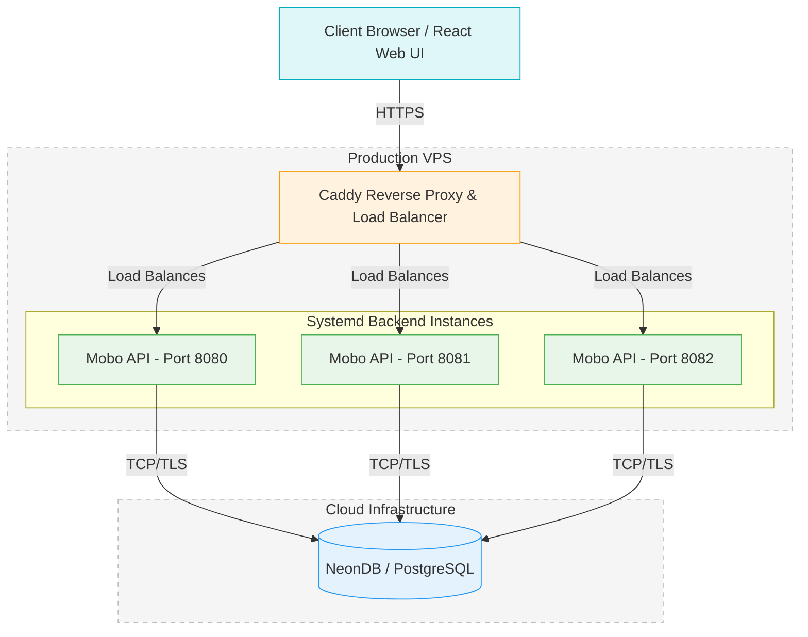

# Mobo Ticketing Service

Mobo is a modern, high-performance backend API for a movie theatre ticketing and reservation system. It provides a robust set of features for managing users, movies, showtimes, and venues, as well as aggregated analytics. The system supports secure authentication (including OIDC built on OAuth 2.0), role-based access control (Admin vs Customer), and transactionally safe bookings.

## System Architecture

Mobo is designed for high availability and is deployed in a production environment using a reverse proxy and multiple backend instances.



- **Frontend:** A React web interface served to the client.
- **Reverse Proxy:** Caddy handles SSL termination and load balances traffic across the backend instances.
- **Backend:** 3 independent instances of the Go API running as `systemd` services on a VPS, ensuring redundancy and fault tolerance.
- **Database:** NeonDB, a serverless cloud PostgreSQL provider, handles all data persistence.

### Software Architecture (Domain-Driven Design)

I'm trying to  follow a strict **Domain-Driven Design (DDD)** pattern. The codebase is organised by business capabilities (domains) rather than technical layers. Technology adapters (like the HTTP server and Postgres repositories) depend downward on pure domain packages, ensuring business logic is isolated and testable.

### Project Structure

```text
ticketing-service/
├── cmd/server/                 # Application entry point. Initializes dependencies and starts the server.
├── config/                     # Configuration management (Viper) reading from .env.
├── deploy/                     # Deployment configurations (e.g., Caddyfile, systemd service files).
├── internal/
│   ├── auth/                   # Core authentication logic (JWT, OIDC).
│   ├── api/                    # HTTP Transport layer. Contains Chi router, handlers, and middleware.
│   ├── postgres/               # Database adapter layer. Manages pgx connection pooling.
│   ├── dbgen/                  # Auto-generated SQL code via sqlc.
│   │
│   │ # DOMAIN PACKAGES (Pure Business Logic)
│   ├── analytics/              # Aggregated dashboard metrics and revenue data.
│   ├── movie/                  # Movie catalog management.
│   ├── showtime/               # Scheduling and availability tracking for movies.
│   ├── user/                   # User identity, roles, and authentication workflows.
│   └── venue/                  # Physical theater location management.
│
├── pkg/                        # Reusable, domain-agnostic utilities (e.g., zap logger).
├── sql/                        # Raw SQL schema migrations and sqlc query definitions.
└── web/                        # React frontend / Web UI application.
```

## Tech Stack & Tools

- **Language:** Go (Golang)
- **Database:** PostgreSQL
- **Database Driver / Pool:** [pgx/v5](https://github.com/jackc/pgx)
- **Data Access:** [sqlc](https://sqlc.dev/) (Type-safe SQL compiler)
- **HTTP Router:** [go-chi/chi](https://github.com/go-chi/chi)
- **Validation:** [go-playground/validator](https://github.com/go-playground/validator)
- **Authentication:** JWT (JSON Web Tokens) with rotating HttpOnly cookies
- **OAuth:** [markbates/goth](https://github.com/markbates/goth) (Google Auth integration)
- **Logging:** [uber-go/zap](https://github.com/uber-go/zap) (Structured JSON logging)
- **Configuration:** [spf13/viper](https://github.com/spf13/viper)

## Key Features

- **Decoupled Architecture:** Business logic operates independently of how data is stored or served.
- **Secure Authentication:** Combines local credentials and OIDC (built on top of OAuth 2). Uses secure, HttpOnly, SameSite cookie-based JWTs with short-lived access tokens and longer-lived refresh tokens.
- **Role-Based Access:** Distinct `Admin` and `User` roles enforced via middleware.
- **Transaction Safety:** Repository methods safely wrap complex multi-step operations (like linking an OAuth identity to a new user profile) in atomic PostgreSQL transactions.
- **Performance Optimized:** Uses `pgxpool` for connection lifecycle management and `httprate` for IP-based rate limiting.

## Getting Started

### Prerequisites

- Go 1.21+
- PostgreSQL database
- [sqlc](https://docs.sqlc.dev/en/latest/overview/install.html) (for modifying database queries)

### Setup

1. **Clone the repository:**
   ```bash
   git clone <repo-url>
   cd ticketing-service
   ```

2. **Configure environment:**
   Create a `.env` file in the root directory mirroring the necessary configuration (Database URI, JWT secret, OAuth credentials, etc.).

3. **Generate database code (if modifying queries):**
   ```bash
   sqlc generate
   ```

4. **Run the application:**
   ```bash
   go run cmd/server/main.go
   ```

### Running Tests

```bash
go test ./...
```
